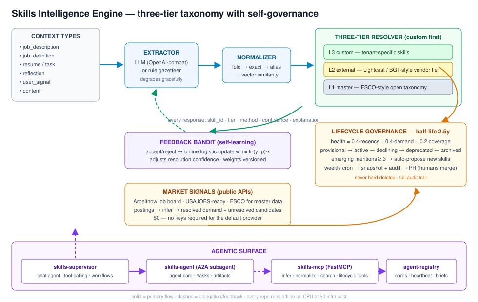
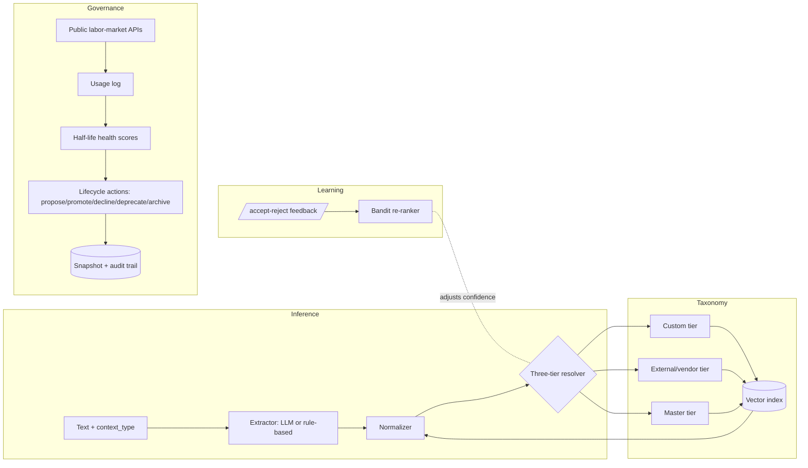

# Skills Intelligence Engine

[](https://github.com/hari2353/skills-engine/actions/workflows/ci.yml)
[](https://github.com/hari2353/skills-engine/actions/workflows/skills-governance.yml)
[](LICENSE)

An open-source, production-pattern reference implementation of a **three-tier enterprise skill taxonomy** with
LLM-powered inference, half-life-driven lifecycle governance, explainable resolution, golden-baseline evaluation,
and a self-learning feedback loop.

> With AI skill half-lives at ~2.5 years (Deloitte), taxonomies curated by hand rot fast. This engine curates itself.



## The full stack

This engine is the core of a five-repo system:

| Repo | Role |
|---|---|
| **skills-engine** (this repo) | taxonomy, inference, lifecycle governance, evals, self-learning |
| [skills-mcp](https://github.com/hari2353/skills-mcp) | FastMCP server exposing the engine as MCP tools |
| [skills-supervisor](https://github.com/hari2353/skills-supervisor) | supervisor chat agent (tool-calling) + A2A skills subagent + deterministic workflows + MCP registry |
| [agent-registry](https://github.com/hari2353/agent-registry) | A2A-style agent discovery, heartbeats, talent briefs |
| [auth-gateway](https://github.com/hari2353/auth-gateway) | JWT/OAuth2 with key rotation and cross-tenant isolation |

## Why this exists

Enterprise talent platforms maintain skill taxonomies across three tiers. This project recreates that pattern
end-to-end with open data and $0 infrastructure:

| Concern | Approach |
|---|---|
| Three-tier resolution | custom → external → master precedence with provenance |
| Skill inference | 7 context types (JDs, resumes, tasks, reflections, user signals, content, job definitions) |
| Normalization | Unicode folding → exact/alias match → embedding similarity fallback |
| Lifecycle | Deloitte-style 2.5y half-life decay → auto-deprecate stale skills, auto-propose emerging ones |
| Trust & explainability | every resolution returns method + confidence + human-readable explanation |
| Evaluation | golden-baseline regression (precision/recall/F1) enforced as a CI gate |
| Self-learning | online contextual bandit re-ranker updated by accept/reject feedback |
| Market signals | public job-board APIs (Arbeitnow; USAJOBS-ready) feed demand + emergence |

## Architecture



## The three tiers

| Tier | Role | Sample data here | Real-world analog |
|---|---|---|---|
| Master | broad canonical taxonomy | `master_skills.csv` (ESCO-style ids) | ESCO / O*NET / SkyHive master graph |
| External | vendor-licensed granular skills | `external_skills.csv` (`lightcast_sim`, `bgt_sim`) | Lightcast Open Skills / BGT |
| Custom | tenant-specific proprietary skills | `custom_skills.csv` | per-org extensions |

Resolution is **custom first**: a tenant redefinition of "Kubernetes" wins over the master entry, and every response
tells you which tier matched and why:

```json
{
  "raw_input": "Kubernetes",
  "skill_id": "cus__3003",
  "tier": "custom",
  "confidence": 1.0,
  "method": "exact",
  "explanation": "exact name match in custom tier"
}
```

## Skill lifecycle (half-life driven)

Health score = `0.4 · recency + 0.4 · market_demand + 0.2 · content_coverage`
where `recency = 0.5 ^ (days_since_last_use / 912)` — a **2.5-year half-life**.

```
provisional ──(≥5 mentions)──▶ active ──(health < 0.35)──▶ declining ──(≥270d stale)──▶ deprecated ──(≥180d)──▶ archived
     ▲                                                                                          │
     └── unresolved market/usage mentions ≥ 3 ◀── weekly signal ingestion ──────────────────────┘
              (never hard-deleted: audit trail preserved)
```

The scheduled workflow (`skills-governance.yml`) runs weekly: ingest postings from a public API → append usage
events → recompute health → apply lifecycle actions → open a PR with the snapshot + audit JSON.
**Humans merge; machines curate.**

Run it locally:

```bash
python -m skills_engine.signals.cli --pages 2      # pull live postings, update signals
python -m skills_engine.lifecycle.cli              # see proposed actions with reasons
python -m skills_engine.lifecycle.cli --apply      # apply + write data/snapshots/<date>/
```

(Set `PYTHONPATH=src` when running from a repo checkout, or `pip install -e .` once packaging is added.)

## Quickstart

```bash
pip install -r requirements.txt
uvicorn skills_engine.api.app:app --reload
```

```bash
curl -X POST localhost:8000/v1/skills/infer -H "Content-Type: application/json" \
  -d '{"text": "Hiring engineers with Python and Kubernetes experience.", "context_type": "job_description"}'

curl -X POST localhost:8000/v1/skills/normalize -d '{"name": "k8s"}' -H "Content-Type: application/json"

curl "localhost:8000/v1/skills/search?q=kafka&k=3"

curl "localhost:8000/v1/lifecycle/report?today=2026-08-23"

curl -X POST localhost:8000/v1/feedback -d '{"raw_input": "Python", "accepted": true}' -H "Content-Type: application/json"
```

Context types: `job_description`, `job_definition`, `resume`, `task`, `reflection`, `user_signal`, `content`.

## LLM backend (optional, free-tier friendly)

Extraction defaults to an offline rule-based gazetteer. Point it at any OpenAI-compatible endpoint to upgrade:

```bash
export SKILLS_LLM_BASE_URL=http://localhost:11434/v1   # Ollama, vLLM, Groq, Gemini-compat...
export SKILLS_LLM_MODEL=qwen2.5:7b
```

If the LLM call fails, inference degrades gracefully to rules and flags `degraded_to_rules: true`.

Embeddings default to a dependency-free hashing embedder; set
`SKILLS_EMBEDDING_BACKEND=sentence_transformers` (+ `pip install sentence-transformers`) for real multilingual MiniLM vectors.

## Evaluation as a CI gate

```bash
python -m skills_engine.evals.cli --min-f1 0.8 --min-accuracy 0.9
```

`data/evals/golden_baseline.csv` pins extraction behavior; `resolution_golden.csv` pins tier-precedence behavior
(including the tricky cases: alias-only master hits vs same-name custom entries). Reports land in
`data/evals/reports/latest.json`. CI fails below thresholds — the same discipline as a 2,000-row enterprise baseline.

## Self-learning re-ranker

Every resolution exposes feature hooks (match method, vector similarity, tier one-hots). Accept/reject feedback via
`POST /v1/feedback` performs an online logistic update (`w += lr·(y−p)·x`) and blends model confidence into future
resolutions, with weights persisted at `data/model/bandit_weights.json` and events appended to `feedback_log.jsonl`.
Confidence shifts are always surfaced in `explanation` — no silent rewrites.

## Cost profile

Everything above runs on laptop CPU with zero paid services. Public APIs used require no key (Arbeitnow) or a free
key (USAJOBS). Vendor-tier rows are synthetic — swap in your own exports; do not ship licensed Lightcast/BGT data.

## Project layout

```
src/skills_engine/
├── taxonomies/      models + CSV store + snapshots
├── embedders/       hashing (default) + sentence-transformers
├── store/           numpy cosine vector index
├── inference/       context types, prompts, rule/LLM extractors
├── normalization/   folding, exact→alias→vector pipeline
├── resolution/      tiered resolver + explanations
├── feedback/        online bandit re-ranker
├── lifecycle/       policy, runner, CLI, audit snapshots
├── signals/         public-API market ingestion
├── evals/           golden baselines + reports
└── api/             FastAPI app
tests/               unit + integration suites
data/                sample taxonomy, signals, eval fixtures
.github/workflows/   ci.yml, skills-governance.yml
```

## Roadmap

- [ ] ClickHouse HNSW index behind the same `VectorIndex` protocol (parity benchmark vs numpy)
- [ ] Bedrock batch-inference mode for offline corpus tagging
- [ ] Multi-locale alias packs + x-Language header precedence chain
- [x] A2A agent card exposure → shipped in [skills-supervisor](https://github.com/hari2353/skills-supervisor) (A2A skills subagent + supervisor chat agent)
- [x] MCP tool exposure → shipped in [skills-mcp](https://github.com/hari2353/skills-mcp)

## License

MIT
